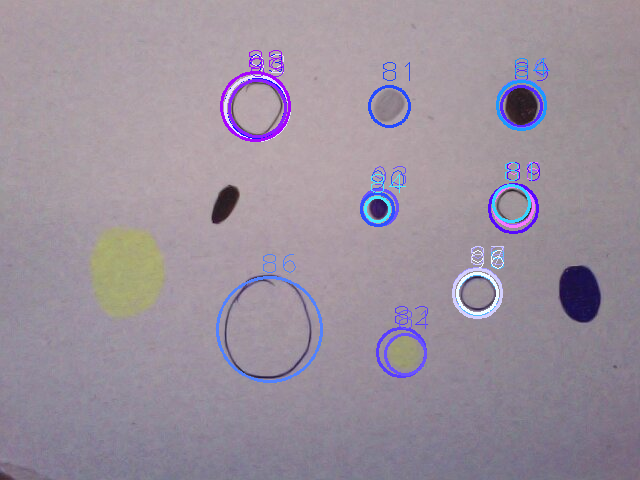
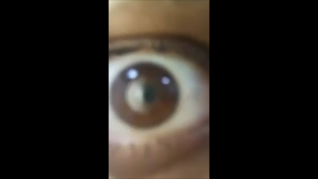
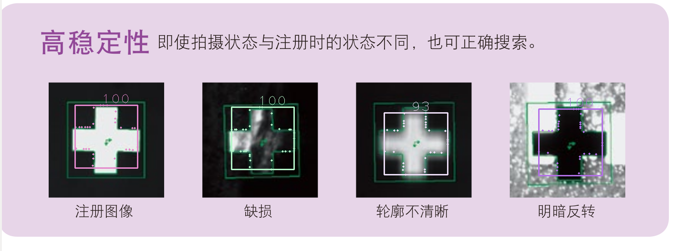

# shape_based_matching  

try to implement halcon shape based matching, refer to machine vision algorithms and applications, page 317 3.11.5, written by halcon engineers  
We find that shape based matching is the same as linemod. [linemod pdf](Gradient%20Response%20Maps%20for%20Real-TimeDetection%20of%20Textureless%20Objects.pdf)  

## thoughts about the method

The key of shape based matching, or linemod, is using gradient orientation only. Though both edge and orientation are resistant to disturbance,
edge have only 1bit info(there is an edge or not), so it's hard to dig wanted shapes out if there are too many edges, but we have to have as many edges as possible if we want to find all the target shapes. It's quite a dilemma.  

However, gradient orientation has much more info than edge, so we can easily match shape orientation in the overwhelming img orientation by template matching across the img.  

Speed is also important. Thanks to the speeding up magic in linemod, we can handle 1000 templates in 20ms or so.  

[Chinese blog about the thoughts](https://www.zhihu.com/question/39513724/answer/441677905)  

## improvment

Comparing to opencv linemod src, we improve from 4 aspects:  

1. delete depth modality so we don't need virtual func, this may speed up  

2. opencv linemod can't use more than 63 features. Now wo can have up to 8191  

3. simple codes for rotating and scaling img for training. see test.cpp for examples  

4. nms for accurate edge selection  

## some test

### Example for circle shape

  

  

  

### circle template before and after nms  

#### before nms

#### after nms

  

### Simple example for arbitary shape

Well, the example is too simple to show the robustness  
running time: 1024x1024, 60ms to construct response map, 7ms for 360 templates  

test img & templ features  
  
  

### noise test  

  
